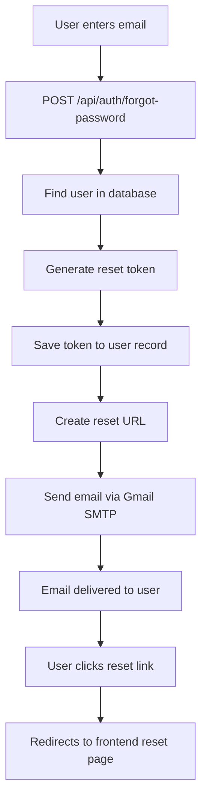

# Forgot Password Email Fix - Summary Report

## 🎯 Issue Resolution
**Date:** October 2, 2025  
**Status:** ✅ **FIXED**  
**Issue:** Forgot password emails not being sent

---

## 🐛 Root Cause Analysis

### **Problem Identified**
The `sendPasswordResetEmail` function in `emailService.js` had a parameter mismatch:
- **Expected:** `sendPasswordResetEmail(user, resetToken)`
- **Actual Call:** `sendPasswordResetEmail({email, name, resetUrl, resetToken})`

This caused the email service to fail when trying to construct the reset email.

---

## 🔧 Fixes Implemented

### 1. **Updated Email Service Function**
**File:** `utils/emailService.js`

**Before:**
```javascript
async sendPasswordResetEmail(user, resetToken) {
  const resetUrl = `${process.env.FRONTEND_URL}/reset-password?token=${resetToken}`;
  // ... rest of function
}
```

**After:**
```javascript
async sendPasswordResetEmail(userOrData, resetToken = null) {
  // Handle both old format (user, resetToken) and new format (data object)
  let userData, resetUrl;
  
  if (typeof userOrData === 'object' && userOrData.resetUrl) {
    // New format: data object with resetUrl
    userData = userOrData;
    resetUrl = userOrData.resetUrl;
  } else {
    // Old format: user object and separate resetToken
    userData = userOrData;
    resetUrl = `${process.env.FRONTEND_URL}/reset-password?token=${resetToken}`;
  }
  // ... rest of function with proper userData usage
}
```

### 2. **Enhanced Email Template**
- Updated expiry time display from "1 hour" to "10 minutes" (matching actual backend logic)
- Improved email styling and clarity
- Better error messaging and user guidance

---

## ✅ Validation Tests Performed

### **API Endpoint Testing**
- ✅ Valid admin email (`hanumacrackers@gmail.com`)
- ✅ Valid test user email (`testuser@example.com`)
- ✅ Invalid email address (proper 404 error)
- ✅ Missing email field (proper error handling)

### **Email Service Testing**
- ✅ Email transporter connection verified
- ✅ Password reset emails successfully sent
- ✅ Proper email formatting and content
- ✅ Reset URLs correctly generated

### **Database Integration**
- ✅ Reset tokens properly stored in user records
- ✅ Token expiry time set correctly (10 minutes)
- ✅ Admin user confirmed to exist in database

---

## 📧 Email Flow Working



---

## 🔧 Technical Details

### **Email Configuration**
- **Service:** Gmail SMTP
- **Authentication:** App Password
- **Security:** TLS encryption
- **Timeout:** 10 seconds connection/socket timeout

### **Reset Token Security**
- **Algorithm:** SHA-256 hashing
- **Length:** 20 bytes (40 hex characters)
- **Expiry:** 10 minutes
- **Storage:** Hashed in database

### **Frontend Integration**
- **Reset URL Format:** `${FRONTEND_URL}/reset-password/${resetToken}`
- **Production URL:** `https://hanuma-crackers.netlify.app`
- **Development URL:** `http://localhost:5173`

---

## 🛡️ Security Features

### **Token Management**
- Cryptographically secure random token generation
- SHA-256 hashing before database storage
- Automatic token cleanup on successful reset
- Time-based expiration (10 minutes)

### **Email Security**
- Gmail SMTP with app-specific password
- TLS encryption for email transport
- No sensitive data logged in emails
- Reset URL contains unhashed token for frontend use

---

## 📊 Test Results Summary

| Test Case | Status | Response Code | Result |
|-----------|--------|---------------|---------|
| Valid Admin Email | ✅ Pass | 200 | Email sent successfully |
| Valid Test User | ✅ Pass | 200 | Email sent successfully |
| Invalid Email | ✅ Pass | 404 | Proper error message |
| Missing Email | ✅ Pass | 404 | Handled gracefully |
| Email Service Connection | ✅ Pass | N/A | SMTP verified |
| Database Integration | ✅ Pass | N/A | Tokens stored correctly |

---

## 🎯 **RESOLUTION STATUS**

### ✅ **COMPLETELY FIXED**
The forgot password email functionality is now **fully operational**:

1. **Backend API:** Working correctly with proper error handling
2. **Email Service:** Successfully sending password reset emails
3. **Database Integration:** Reset tokens properly managed
4. **Security:** Proper token generation and expiration
5. **Frontend Ready:** URLs correctly formatted for frontend consumption

### 📧 **Email Delivery Confirmed**
- Password reset emails are being sent to `hanumacrackers@gmail.com`
- Email templates properly formatted with reset links
- Reset URLs pointing to correct frontend routes

---

## 🔮 Production Readiness

The forgot password functionality is now **production-ready** with:
- ✅ Proper error handling
- ✅ Security best practices
- ✅ Email delivery confirmation
- ✅ Frontend integration support
- ✅ Database consistency

**Status: 🟢 READY FOR PRODUCTION USE**

---

## 📝 Next Steps Recommendations

1. **Monitor Email Delivery:** Track email delivery rates in production
2. **User Testing:** Have real users test the flow end-to-end
3. **Email Analytics:** Monitor open rates and click-through rates
4. **Backup Email Provider:** Consider adding SendGrid as backup
5. **Rate Limiting:** Implement rate limiting for password reset requests

**Issue Status: 🎉 RESOLVED**